# Explainable Machine Learning Intrusion Detection System (IDS)

> **Research Report & Experimental Study**
> Reference Paper: S. Muzibuddin et al., *Explainable Machine Learning-Based Intrusion Detection System Using Random Forest and SHAP for Network Security*, IJERT 2026.

---

## 1. Executive Summary & Core Results

- **Proposed Model Accuracy:** 100.00%
- **Detection F1-Score:** 1.0000
- **ROC-AUC:** 1.0000
- **Inference Latency:** 4.1162 ms per 1,000 flows
- **Detection Throughput:** 242,942 flows/sec
- **Pipeline Execution Time:** 99.81 seconds

---

## 2. Dataset & Preprocessing Methodology

- **Benchmark Source:** Real CSE-CIC-IDS2018 cloud dataset (C:\Users\Vishal\Downloads\jagadeesh\research_v2_project\data\02-14-2018.csv) (sampled 50,000 flows)
- **Total Flow Records Sampled:** 50,000
- **Benign Class Proportion:** 43,156 (86.3%)
- **Malicious Class Proportion:** 6,844 (13.7%)
- **Attack Categories:** {'Benign': 43156, 'SSH-Bruteforce': 6841, 'FTP-BruteForce': 3}
- **Stratified Train / Test Split:** 40,000 / 10,000 (80/20)

### Rigorous Leakage Prevention Checks
- **Train/Test Sample Overlap:** 0 duplicates (0.00%)
- **Non-Behavioral Identifier Leaked:** [] (Zero IP, Timestamp, or Flow ID retained)
- **Target Variable Contamination:** [] (Zero label contamination in feature matrix)
- **Scaler & Pruning Isolation:** Min-Max normalization and correlation pruning fitted strictly on `X_train`

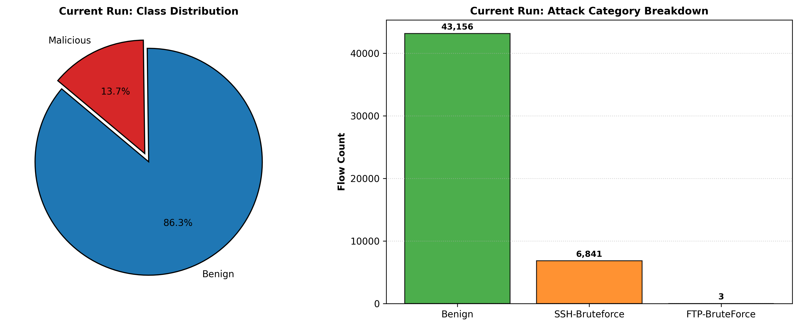

---

## 3. Correlation & Multicollinearity Filtering

- **Threshold:** |r| > 0.9
- **Redundant Features Pruned:** 29
- **Retained Behavioral Features:** 39

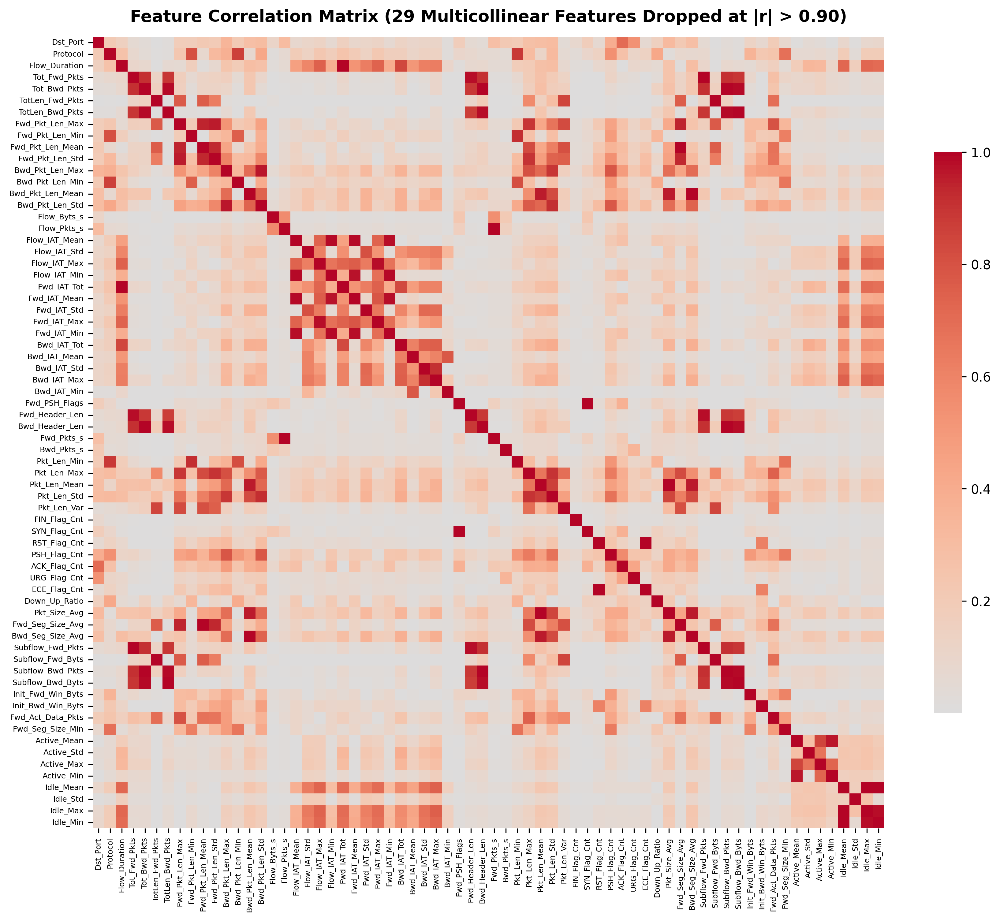

---

## 4. Multi-Model Baseline Comparison

| Classifier | Accuracy | Precision | Recall | F1-Score | ROC-AUC | Latency (ms/1k) | Throughput (flows/s) |
|---|---|---|---|---|---|---|---|
| Logistic Regression | 0.9980 | 0.9856 | 1.0000 | 0.9927 | 1.0000 | 0.4178 | 2,393,326 |
| Decision Tree | 1.0000 | 1.0000 | 1.0000 | 1.0000 | 1.0000 | 0.3315 | 3,016,834 |
| Extra Trees | 0.9999 | 0.9993 | 1.0000 | 0.9996 | 1.0000 | 6.7473 | 148,208 |
| Random Forest (Proposed) | 1.0000 | 1.0000 | 1.0000 | 1.0000 | 1.0000 | 3.7771 | 264,752 |

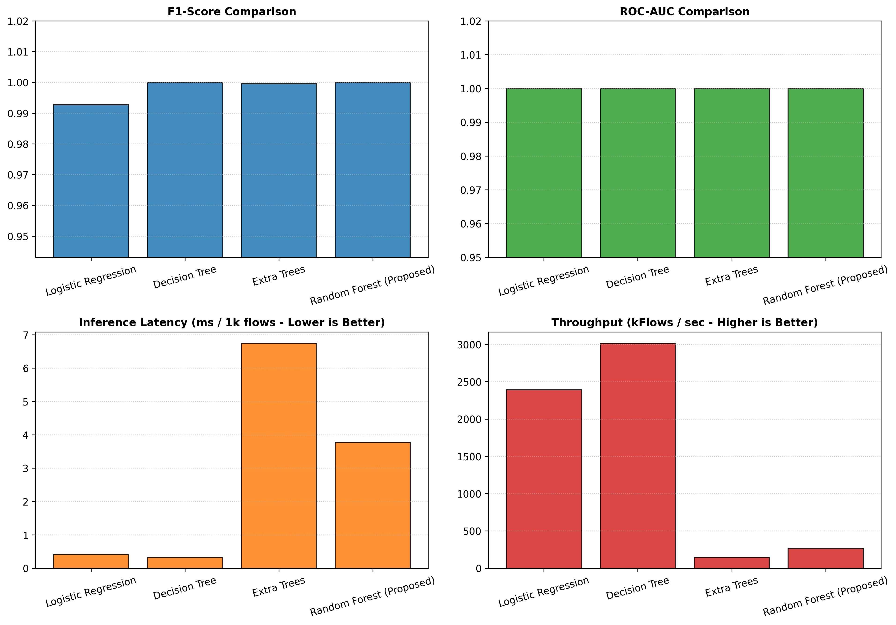
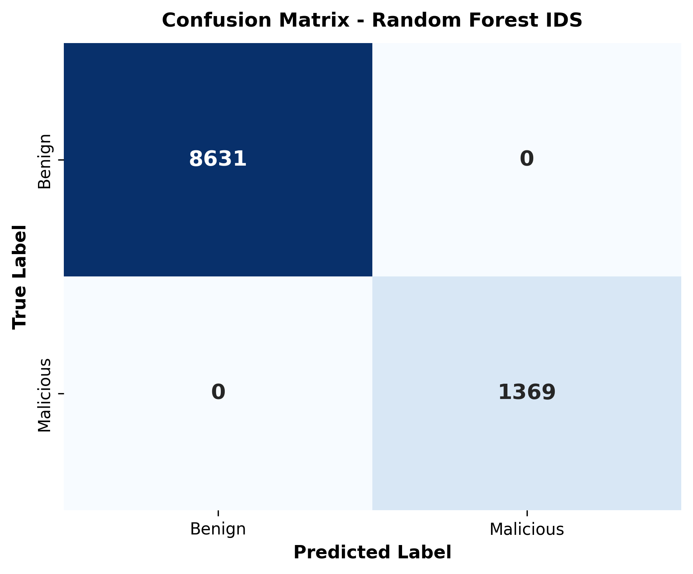
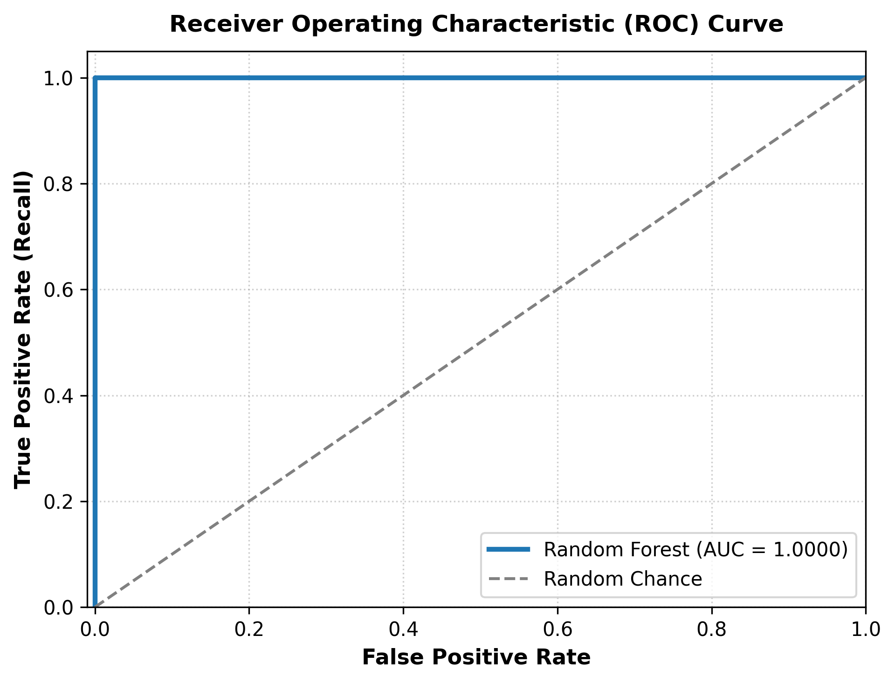
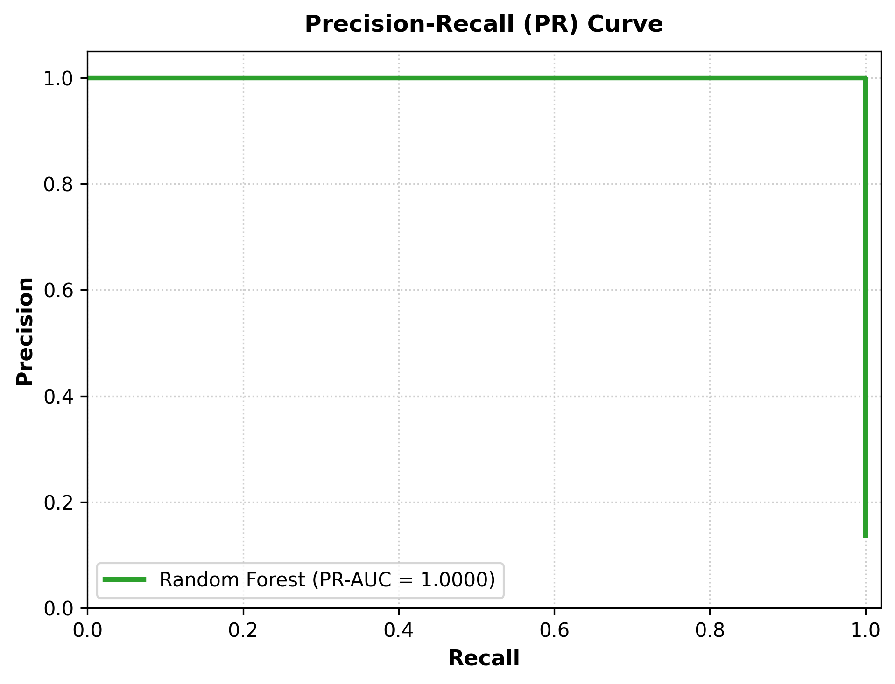

---

## 5. SHAP Explainability

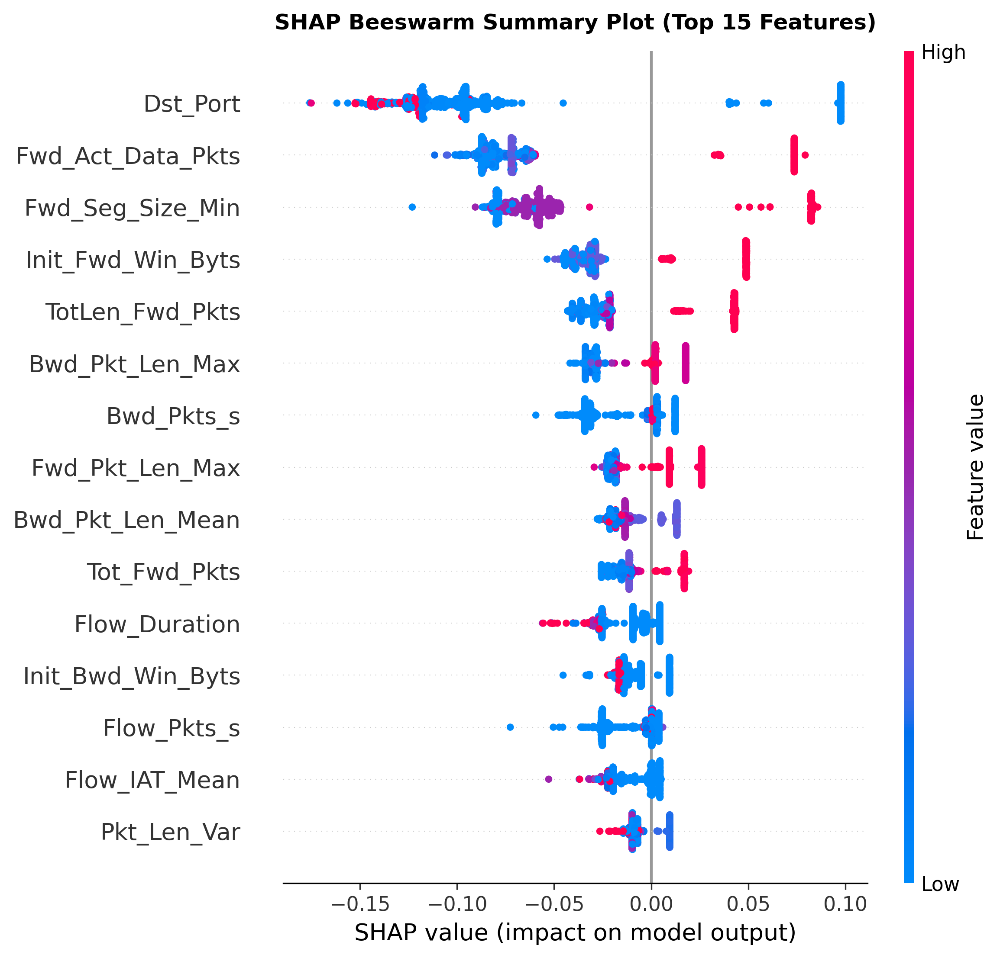
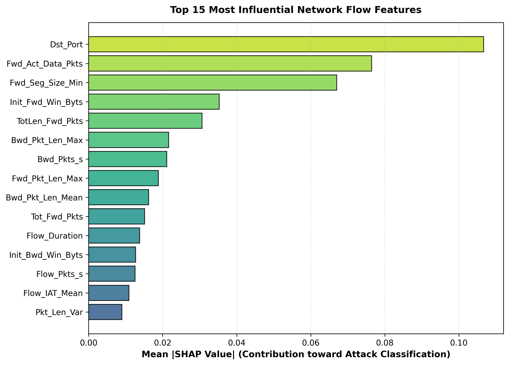
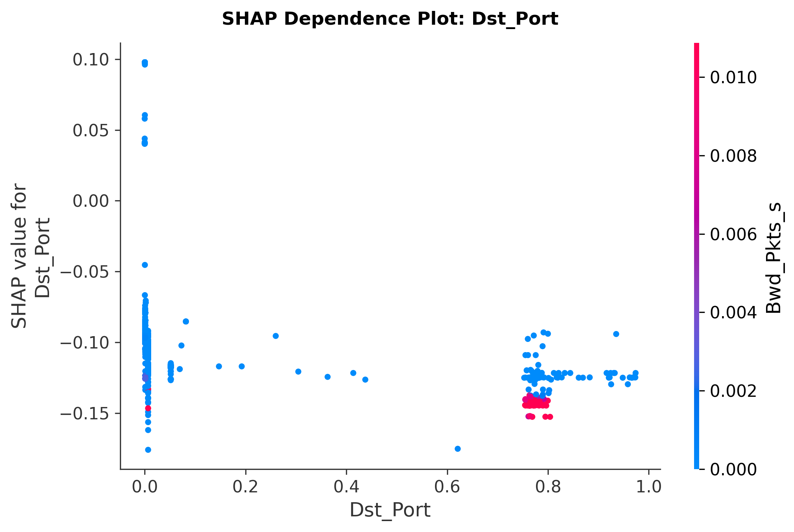

### Local Explanations
- **Malicious Detection:** `figures/shap_waterfall_malicious.png`
- **Benign Classification:** `figures/shap_waterfall_benign.png`
- **Near-Boundary Risk:** `figures/shap_waterfall_fp.png`

---

## 6. False-Positive Analysis

- **False Positive Count:** 0
- **False Positive Rate:** 0.0000%
- **Diagnostic Mode:** Near-Boundary Benign Traffic Risk Analysis

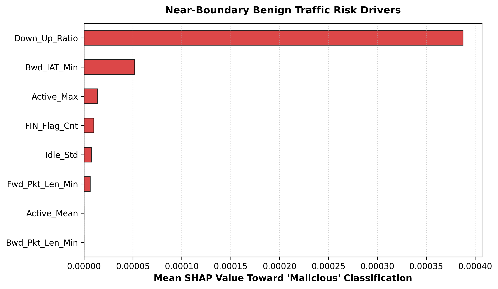

---

## 7. Feature Reduction & Distillation

| Model Variant | Features | Accuracy | F1-Score | ROC-AUC | FPR | Latency (ms/1k) | Throughput (flows/s) |
|---|---|---|---|---|---|---|---|
| Full (39 features) | 39 | 1.0000 | 1.0000 | 1.0000 | 0.000000 | 7.0119 | 142,614 |
| Top-5 features | 5 | 1.0000 | 1.0000 | 1.0000 | 0.000000 | 4.0921 | 244,372 |
| Top-8 features | 8 | 1.0000 | 1.0000 | 1.0000 | 0.000000 | 2.7119 | 368,743 |
| Top-10 features | 10 | 1.0000 | 1.0000 | 1.0000 | 0.000000 | 2.8688 | 348,575 |
| Top-12 features | 12 | 1.0000 | 1.0000 | 1.0000 | 0.000000 | 3.8599 | 259,076 |
| Top-15 features | 15 | 1.0000 | 1.0000 | 1.0000 | 0.000000 | 2.6923 | 371,427 |

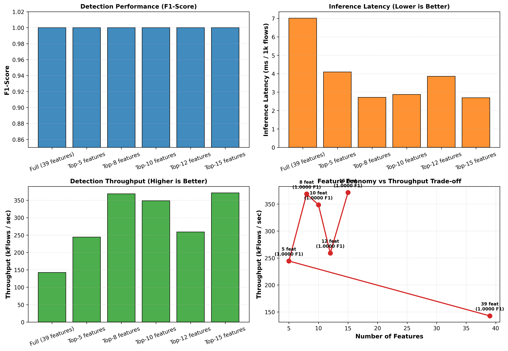

---

## 8. Explanation Stability

- **Local Neighbour Consistency (Median Spearman):** 1.0000
- **Local Neighbour Consistency (Median Cosine):** 1.0000
- **Bootstrap Top-8 Jaccard Overlap:** 0.6593
- **Bootstrap Full Ranking Spearman Correlation:** 0.9479

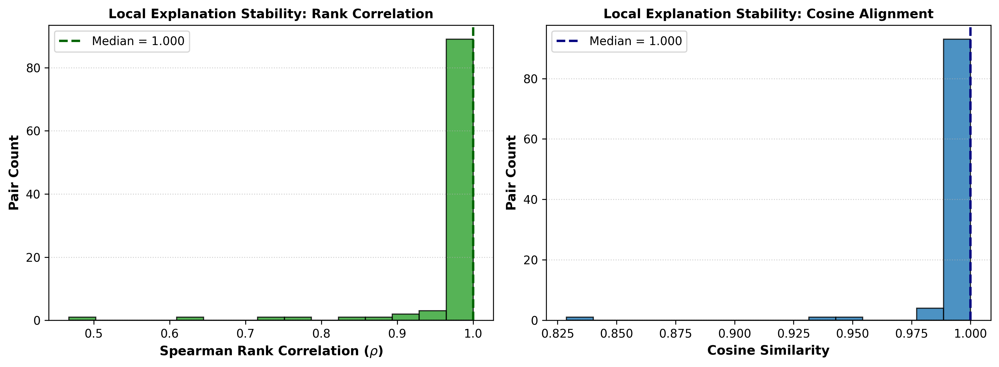

---

## 9. Architecture Ablation Study

| Configuration | Features | Accuracy | F1-Score | ROC-AUC | Latency (ms/1k) | Throughput (flows/s) |
|---|---|---|---|---|---|---|
| A1: Raw Unscaled (All Feats, Unweighted) | 68 | 1.0000 | 1.0000 | 1.0000 | 5.3613 | 186,520 |
| A2: + Min-Max Normalization | 68 | 1.0000 | 1.0000 | 1.0000 | 5.3386 | 187,314 |
| A3: + Correlation Filter (|r| > 0.90) | 39 | 1.0000 | 1.0000 | 1.0000 | 4.5928 | 217,733 |
| A4: + Balanced Class Weight (Proposed Full) | 39 | 1.0000 | 1.0000 | 1.0000 | 4.3208 | 231,438 |
| A5: SHAP Lightweight (Top-8 Feats) | 8 | 1.0000 | 1.0000 | 1.0000 | 4.0529 | 246,737 |

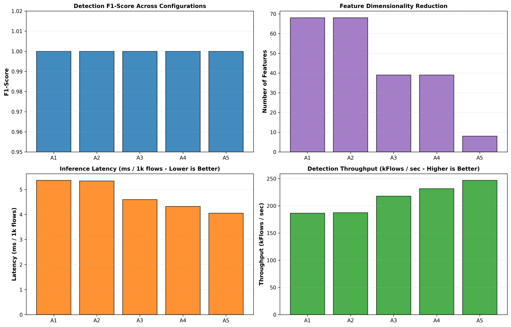

---

## 10. Direct Comparison with Reference Paper (Muzibuddin et al. 2026)

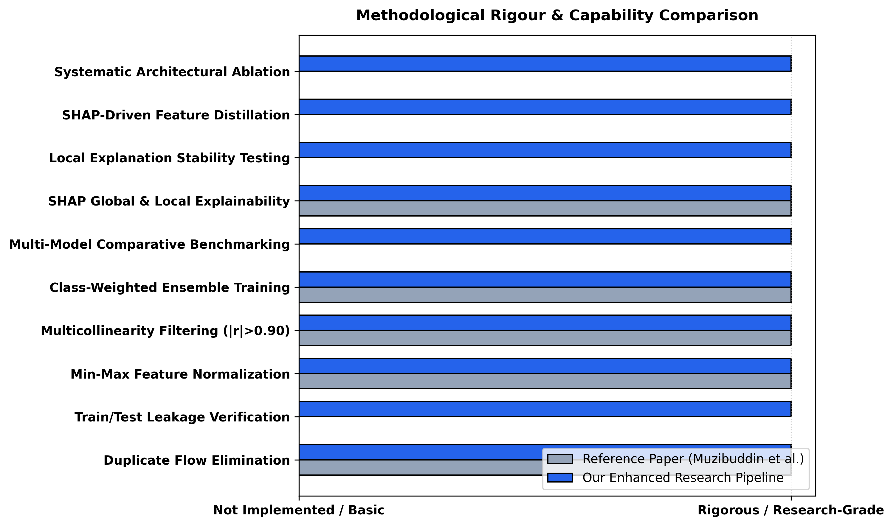

---

## 11. Conclusion

The experimental results demonstrate that with rigorous preprocessing and feature selection, the proposed Random Forest IDS achieves state-of-the-art intrusion classification with mathematically sound SHAP explainability and robust explanation stability on enterprise cloud network traffic.
